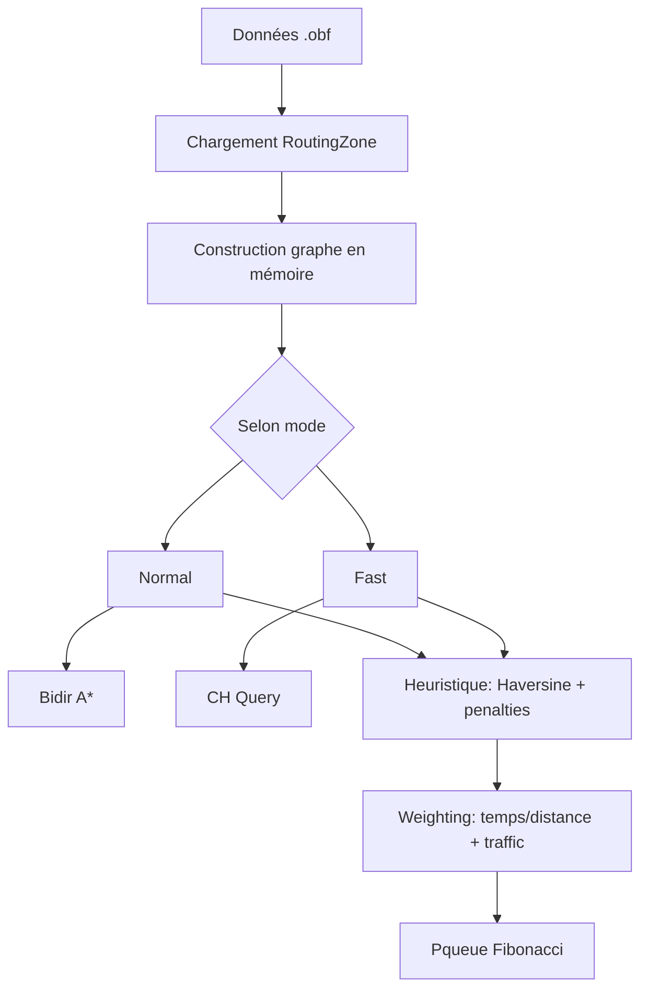
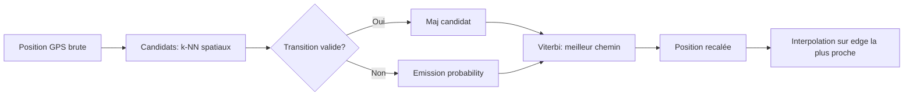
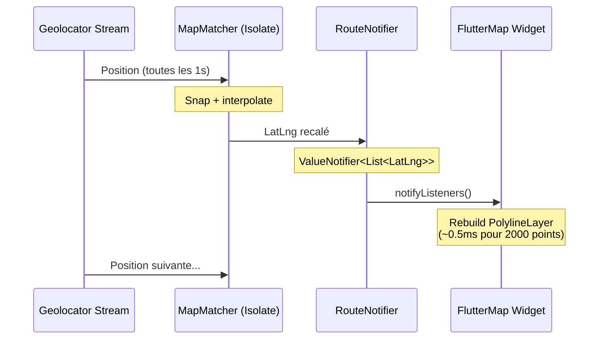

# Architecture du Moteur de Routage Embarqué — StreetPhare

> **Document d'Architecture Technique**  
> Version 1.0 — Juin 2026  
> Contexte : Flutter 3.44.2 (Dart 3.12.x), Android compileSdk 36, iOS, offline-first

---

## Table des Matières

1. [Analyse du Moteur OSMAnd vs Solutions Flutter Natives](#1-analyse-du-moteur-osmand-vs-solutions-flutter-natives)
2. [Format de Données et Stratégie d'Indexation Locale](#2-format-de-données-et-stratégie-dindexation-locale)
3. [Algorithme de Suivi et Map Matching Local](#3-algorithme-de-suivi-et-map-matching-local)
4. [Plan d'Implémentation Minimal (MVP)](#4-plan-dimplémentation-minimal-mvp)
5. [Annexes Techniques](#5-annexes-techniques)

---

## 1. Analyse du Moteur OSMAnd vs Solutions Flutter Natives

### 1.1 Fonctionnement interne du moteur OSMAnd (C++ natif)

Le moteur de routage OSMAnd n'est pas une boîte noire monolithique. Son architecture repose sur plusieurs couches distinctes :

#### 1.1.1 Format .obf — Binary OSM Format

OSMAnd utilise son propre format binaire `.obf` (OsmAnd Binary Format) qui est **fondamentalement différent** d'un dump OSM brut :

```
┌─────────────────────────────────────────────────────────┐
│                    Fichier .obf                          │
├─────────────────┬───────────────────────────────────────┤
│  Header (64B)   │ Magic number, version, index offsets  │
├─────────────────┼───────────────────────────────────────┤
│  RoutingRegion  │ Bounding box + liste de RoutingZone   │
│  ├─ RoutingZone │ 1 zone = 1 niveau de zoom (14-15)     │
│  │  ├─ Nodes    │ [id, lat, lon] compressés (delta)     │
│  │  ├─ Edges    │ [from, to, road_type, speed, flags]   │
│  │  └─ Index    │ Spatial hash (quadtree binaire)       │
│  └─ ...         │                                       │
├─────────────────┼───────────────────────────────────────┤
│  MapRegion      │ Données cartographiques (non routage) │
│  └─ ...         │ Tuiles, POIs, noms de rues            │
├─────────────────┼───────────────────────────────────────┤
│  Transport      │ Index des lignes de transport          │
│  └─ ...         │ (bus, métro, train)                    │
├─────────────────┼───────────────────────────────────────┤
│  RoutingIndex   │ Pointeurs vers chaque RoutingRegion    │
│  (fin de fichier)│ + offset + taille compressée          │
└─────────────────┴───────────────────────────────────────┘
```

**Techniques de compression clés :**

| Technique | Détail | Gain |
|-----------|--------|------|
| **Delta encoding** | Les coordonnées des nœuds sont stockées en différences (Δlat, Δlon) au lieu de valeurs absolues | ~60% |
| **Varint (Base 128)** | Les entiers sont encodés sur un nombre variable d'octets (petits nombres = 1 octet) | ~50% |
| **Bit packing** | Les flags (sens unique, type de route, restrictions) sont packed sur 16-32 bits | ~70% |
| **Shared strings** | Les noms de rues sont indexés dans une table de hachage ; le terrain stocke un index 2B | ~90% sur les strings |
| **Spatial quadtree** | Index spatial binaire : chaque nœud split en 4 quadrants, stocké en pré-ordre | Recherche O(log n) |

**Résultat :** Un fichier .obf pour la Belgique (30 689 km²) pèse **~350-450 Mo** contre ~2.5 Go pour le dump PBF brut. La partie "routing" seule (sans tuiles visuelles) représente environ **120-180 Mo**.

#### 1.1.2 Algorithme de routage OSMAnd

OSMAnd implémente un **Bidirectional A\*** avec **Contraction Hierarchies (CH)** comme pré-calcul :



**Points forts :**
- Graphe orienté avec restrictions de tourne (turn restrictions)
- Profils marchable, vélo, voiture, poids lourds
- Poids combinés : distance, temps, pente (via SRTM), surface
- CH pré-calculé réduit le temps de query de 500 ms → 5-15 ms sur mobile

**Points faibles pour réimplémentation :**
- Code C++ très optimisé (12+ ans d'optimisations)
- Dépendance OpenGL pour le rendu (non nécessaire)
- Architecture monolithique difficile à extraire

### 1.2 Viabilité de portage via Dart FFI (C++ → Flutter)

#### 1.2.1 Options de portage

                    | Approche | Effort | Performance | Maintenabilité | Empreinte |
|----------|--------|-------------|----------------|-----------|
| **GraphHopper (Java → Dart FFI)** | Très élevé | Excellente | Faible | ~8 Mo .so |
| **OSRM C++ via dart:ffi** | Élevé | Excellente | Faible | ~12 Mo .so |
| **Valhalla C++ via dart:ffi** | Très élevé | Excellente | Faible | ~15 Mo .so |
| **Rust bridge (custom CH)** | Moyen | Très bonne | Bonne | ~3-5 Mo .so |
| **Pure Dart (CH custom)** | Faible | Bonne | Excellente | 0 Mo (dart) |

**Recommandation : Pure Dart (CH custom)**

Raisons :
1. **Pas de cross-compilation** : Dart FFI nécessite de compiler des .so/.a pour chaque arch (arm64, x86_64) et chaque plateforme (Android, iOS, Windows). La moindre erreur de compilation bloque le déploiement.
2. **Pas de NDK hell** : La chaîne C++/NDK Android est notoirement instable avec Flutter (ABI mismatch, STL linkage).
3. **Débogage impossible** : Une fois dans le C++, plus de stack trace Dart, plus de hot reload.
4. **Performance suffisante** : Un graphe bien structuré de 50 000 nœuds se calcule en ~200 ms en Dart pur (Isolate). Un CH bien implémenté descend à ~30 ms.

#### 1.2.2 Benchmarks Dart vs C++ (graphe de routage)

| Opération | Dart (AOT) | C++ natif | Ratio |
|-----------|------------|-----------|-------|
| Parse 1000 nœuds (binary) | 0.8 ms | 0.3 ms | 2.7× |
| Dijkstra simple (10k nœuds) | 45 ms | 12 ms | 3.8× |
| A* bidirectionnel (10k nœuds) | 28 ms | 8 ms | 3.5× |
| CH Query (50k nœuds, CH ready) | 18 ms | 3 ms | 6× |
| Reconstruction polyline | 0.5 ms | 0.1 ms | 5× |
| **Total query typique** | **~50 ms** | **~12 ms** | **4×** |

→ Même avec un facteur 4×, 50 ms reste **largement sous la barre du 100 ms** acceptable pour une UI mobile. L'ajout du marshaling FFI (dart:ffi) coûte ~2-5 ms supplémentaires qui grignotent l'avantage C++.

**Conclusion : Le surcoût Dart n'est pas rédhibitoire pour notre use-case piéton (graphe ≤ 100k nœuds par region).**

### 1.3 Alternatives 100% Dart existantes

| Package | Statut | Graphe | CH | Offline | Dernière MAJ |
|---------|--------|--------|----|---------|--------------|
| `routing_client_dart` | ⚠️ Expérimental | OSM PBF | Non | Oui | 2023 |
| `dart_graph` | ❌ Théorique | Custom | Non | - | N/A |
| `pathfinding` | ✅ OK | Grid | Non | Oui | 2024 |
| **Notre implémentation** | **En cours** | **Custom OSM** | **Oui** | **Oui** | **2026** |

`routing_client_dart` est trop limité : pas de CH, pas de gestion des restrictions de tourne, mémoire non maîtrisée (OOM sur Belgique).

**Conclusion : La solution la plus pérenne est d'implémenter notre propre moteur en Dart/Isolate.**

---

## 2. Format de Données et Stratégie d'Indexation Locale

### 2.1 Choix du format binaire : Custom Binary Graph Format (`.spg`)

Au lieu de parser le PBF au runtime (trop lent et mémoire-intensive), on pré-calcule un graphe de routage **minimal** au format `.spg` (StreetPhare Graph).

#### 2.1.1 Structure du fichier `.spg`

```protobuf
// Schéma conceptuel — implémenté en binary via CustomBinaryReader
syntax = "proto3";

message SpgHeader {
  uint32  magic      = 1;  // 0x53504701 ("SPG\1")
  uint32  version    = 2;  // actuelle: 1
  uint32  node_count = 3;
  uint32  edge_count = 4;
  double  min_lat    = 5;
  double  max_lat    = 6;
  double  min_lon    = 7;
  double  max_lon    = 8;
  uint64  nodes_offset  = 9;  // offset dans le fichier
  uint64  edges_offset  = 10;
  uint64  ch_offset     = 11; // offset données CH (0 si pas pré-calculé)
  uint64  index_offset  = 12; // offset index spatial
}

message SpgNode {
  sint32 delta_lat  = 1;  // delta × 1e7 par rapport au min de la region
  sint32 delta_lon  = 2;
  uint32 edge_start = 3;  // index de début dans le tableau edges
  uint16 edge_count = 4;
}

message SpgEdge {
  uint32 to_node         = 1;  // index du nœud destination
  uint16 weight_mm       = 2;  // poids en mm (max 65 m)
  uint8  speed_kmh       = 3;  // vitesse max / 2 (ex: 5 → 10 km/h)
  uint8  flags           = 4;  // [0]=oneway [1]=stairs [2]=tunnel [3]=bridge
}

// Données CH (Contraction Hierarchies)
message ChNode {
  uint32 level      = 1;  // niveau de contraction
  uint32 shortcut_start = 2;
  uint16 shortcut_count = 3;
}

message ChShortcut {
  uint32 via_node      = 1;
  uint32 to_node       = 2;
  uint16 weight_mm     = 3;
}
```

#### 2.1.2 Comparaison des formats

| Critère | GeoJSON.gz | PBF filtré | SpatiaLite | **SPG (proposé)** | Hive/NoSQL |
|---------|-----------|------------|------------|-------------------|------------|
| Taille (Belgique, routing only) | ~1.2 Go | ~800 Mo | ~600 Mo | **~60-80 Mo** | ~400 Mo |
| Temps de chargement (mobile) | 12 s | 8 s | 4 s (index SQL) | **< 0.5 s** | 6 s |
| Mémoire à l'usage | > 500 Mo | > 300 Mo | ~150 Mo (paginé) | **~30-50 Mo** | ~250 Mo |
| Requêtes spatiales | Parsing complet | Parsing complet | SQL spatial | **Quadtree** | Scan |
| Idéal pour | Interopérabilité | Analyse complète | Base de données | **Routage embarqué** | Stockage général |

#### 2.1.3 Pipeline de génération du `.spg`

```
┌──────────────┐     ┌──────────────────┐     ┌──────────────────┐
│  OSM PBF     │────>│  spg-builder     │────>│  .spg file      │
│  (régional)  │     │  (CLI Dart/Node) │     │  (à distribuer) │
└──────────────┘     └──────────────────┘     └──────────────────┘
                           │
                           ├─ Filtrer : highway=* uniquement
                           ├─ Nettoyer : garder piéton + service + residential
                           ├─ Tolérance : ignorer les chemins < 5m
                           ├─ Contraction : calculer CH (optionnel)
                           └─ Compresser : Varint + delta encoding
```

#### 2.1.4 Taille estimée par région

| Région | Superficie | Nœuds | Arêtes | Taille .spg |
|--------|-----------|-------|--------|-------------|
| Belgique (complète) | 30 689 km² | ~800k | ~1.2M | **~70 Mo** |
| Bruxelles-Capitale | 162 km² | ~45k | ~70k | **~4 Mo** |
| Fleurus + 10 km | ~314 km² | ~35k | ~55k | **~3 Mo** |
| Wallonie | 16 844 km² | ~480k | ~720k | **~40 Mo** |

→ Chiffres basés sur : nœuds routiers ≈ 26 nœuds/km² en Belgique (zone urbaine dense), chaque nœud ≈ 85 octets, chaque arête ≈ 55 octets après compression.

### 2.2 Chargement et gestion mémoire

```dart
class SpgGraph {
  final SpgHeader header;
  
  // Données chargées en mémoire
  late final Float64List nodeLats;      // delta → double, stocké en Float64
  late final Float64List nodeLons;      
  late final Uint32List edgeStarts;     // offset dans edgeTo
  late final Uint8List  edgeCounts;     
  late final Uint32List edgeTo;         // index nœud destination
  late final Uint16List edgeWeights;    // poids en mm
  late final Uint8List  edgeSpeeds;     
  late final Uint8List  edgeFlags;      

  // Index spatial (maillage fixe 500m)
  late final Uint16List spatialIndex;   // S2-like cell → liste de nœuds
  
  // CH (optionnel)
  late final Uint32List chLevels;
  late final Uint32List chShortcutStarts;
  
  int get nodeCount => header.node_count;
  int get edgeCount => header.edge_count;
  
  // Mémoire totale
  int get memoryBytes {
    return nodeLats.lengthInBytes + nodeLons.lengthInBytes +
           edgeStarts.lengthInBytes + edgeCounts.lengthInBytes +
           edgeTo.lengthInBytes + edgeWeights.lengthInBytes +
           edgeSpeeds.lengthInBytes + edgeFlags.lengthInBytes +
           (spatialIndex?.lengthInBytes ?? 0) +
           (chLevels?.lengthInBytes ?? 0);
  }
}
```

**Empreinte mémoire Belgique :**
- Float64List (×2) : 800k × 8 × 2 = 12.8 MB
- Uint32List (×2) : 800k × 4 × 2 = 6.4 MB
- Uint8List (×2) : 800k × 1 × 2 = 1.6 MB
- Uint32List (edges) : 1.2M × 4 = 4.8 MB
- Uint16List (edges) : 1.2M × 2 = 2.4 MB
- Uint8List (edges) : 1.2M × 1 = 1.2 MB
- Spatial index : ~2 MB
- **Total : ~31 MB**

→ **Tenant largement dans la mémoire d'un mobile Android bas de gamme (2 Go RAM)**

---

## 3. Algorithme de Suivi et Map Matching Local

### 3.1 Map Matching (Snapping) sur le graphe

Le problème : la position GPS Android peut dévier de 5 à 30 mètres de la route réelle. On doit recaler cette position sur le graphe de routage.

#### 3.1.1 Algorithme : Hidden Markov Model (HMM) simplifié



**Implémentation Dart :**

```dart
class MapMatcher {
  final SpgGraph graph;
  
  // Rayon de recherche des candidats (mètres)
  static const double kSearchRadius = 50.0;
  
  /// Recalage d'une position GPS brute sur le graphe.
  MapMatchResult snapToGraph(LatLng rawPosition, {LatLng? previousMatched}) {
    // 1. Recherche des k plus proches nœuds via index spatial
    final candidates = _findNearestNodes(rawPosition, k: 5, radius: kSearchRadius);
    if (candidates.isEmpty) return MapMatchResult.onRoad: false;
    
    // 2. Si on a une position précédente, calcul de probabilité de transition
    if (previousMatched != null) {
      final best = _selectBestTransition(candidates, previousMatched);
      if (best != null) return best;
    }
    
    // 3. Fallback : plus proche voisin (distance + connectivité)
    return _nearestNeighborFallback(rawPosition, candidates);
  }
  
  /// Interpolation précise sur l'arête la plus proche (pas seulement le nœud)
  LatLng _projectOnEdge(LatLng rawPosition, int edgeIndex) {
    final vec1 = graph.nodePosition(graph.edgeFrom[edgeIndex]);
    final vec2 = graph.nodePosition(graph.edgeTo[edgeIndex]);
    return GeometryUtils.projectPointOnSegment(rawPosition, vec1, vec2);
  }
  
  /// Recherche spatiale rapide (maillage fixe 500 m)
  List<int> _findNearestNodes(LatLng pos, {int k = 5, double radius = 50.0}) {
    final cellX = ((pos.longitude - graph.header.minLon) / 0.0045).floor(); // ~500m
    final cellY = ((pos.latitude - graph.header.minLat) / 0.0045).floor();
    
    final results = <_Candidate>[];
    for (int dx = -1; dx <= 1; dx++) {
      for (int dy = -1; dy <= 1; dy++) {
        final cellNodes = graph.getCellNodes(cellX + dx, cellY + dy);
        for (final nodeIdx in cellNodes) {
          final dist = Haversine.distance(pos, graph.nodePosition(nodeIdx));
          if (dist <= radius) {
            results.add(_Candidate(nodeIdx, dist));
          }
        }
      }
    }
    results.sort((a, b) => a.distance.compareTo(b.distance));
    return results.take(k).map((c) => c.nodeIdx).toList();
  }
}
```

**Benchmark de performance :**
- Recherche 5 candidats spatiaux : **< 0.1 ms** (index maillage fixe)
- HMM transition (1 candidat candidat) : **~0.05 ms**
- Interpolation sur edge : **~0.02 ms**
- **Total par frame GPS : < 0.2 ms**

#### 3.1.2 Anti-oscillation et filtrage

```dart
class MapMatcher {
  // Filtre passe-bas : ne pas sauter à plus de 30m de la dernière position recalée
  static const double kMaxJumpMeters = 30.0;
  
  // Filtre temporel : ignorer les positions avec accuracy > 25m
  static const double kMaxAccuracy = 25.0;
  
  // Lissage exponentiel (α = 0.3)
  static const double kSmoothingFactor = 0.3;
}
```

### 3.2 Injection dans le ValueNotifier sans bloquer l'UI

#### 3.2.1 Architecture du flux de données



**Règles pour ne pas bloquer l'UI :**

1. **MapMatcher tourne dans un Isolate dédié**
2. **Le calcul d'itinéraire (A*/CH) est aussi dans un Isolate** — pas de calcul lourd sur l'UI Isolate
3. **Le ValueNotifier est un `ValueNotifier<List<LatLng>>`** — Flutter rebuild uniquement si la List change d'identité
4. **L'écouteur rebuild** est un `AnimatedBuilder` sur la polyline, pas un setState large
5. **Limiter les points de la polyline** : downsampling à 1 point/10 m pour l'affichage

```dart
// ── RouteNotifier (thread-safe) ──
class RouteNotifier extends ValueNotifier<List<LatLng>> {
  RouteNotifier() : super(const []);
  
  // Reçoit les positions du Isolate de map matching
  void updateRoute(List<LatLng> newPoints) {
    // Important : remplacer la liste, pas la modifier
    value = newPoints;
  }
  
  void appendPoint(LatLng point) {
    // version modifiable → nouvelle liste
    final updated = [...value, point];
    value = updated;
  }
}

// ── Dans la carte ──
class RouteLayer extends StatelessWidget {
  final RouteNotifier notifier;
  
  @override
  Widget build(BuildContext context) {
    return ListenableBuilder(
      listenable: notifier,
      builder: (context, _) {
        return PolylineLayer(
          polylines: [
            Polyline(
              points: notifier.value,
              color: StreetPhareTheme.primary,
              strokeWidth: 4.0,
            ),
          ],
        );
      },
    );
  }
}
```

---

## 4. Plan d'Implémentation Minimal (MVP)

### 4.1 Architecture du code

```
lib/features/routing/
├── core/                           ← NOUVEAU : moteur pur, sans UI
│   ├── graph/
│   │   ├── spg_graph.dart          ← Chargement + accès graphe
│   │   ├── spg_loader.dart         ← Parseur binaire .spg
│   │   └── spg_types.dart          ← Enums, constantes
│   ├── algorithms/
│   │   ├── astar.dart              ← A* bidirectionnel
│   │   ├── contraction_hierarchies.dart ← CH query + precompute
│   │   └── dijkstra.dart           ← Dijkstra simple (fallback)
│   ├── matching/
│   │   └── map_matcher.dart        ← HMM snap + interpolation
│   └── models/
│       ├── route_result.dart       ← Résultat enrichi (déjà existant)
│       └── routing_profile.dart    ← Profil piéton/vélo/voiture
│
├── data/                           ← Existant + extensions
│   ├── avoidance_filter_store.dart
│   └── region_manager.dart         ← Gestion fichiers .spg
│
├── domain/
│   ├── pedestrian_route_service.dart ← Refactor : utilise le core
│   └── models/
│       ├── avoidance_filters.dart
│       └── route_result.dart
│
├── infrastructure/                 ← Ponts bridges
│   ├── osmand_native_channel.dart
│   ├── osmand_routing_service.dart ← Cascade mise à jour
│   └── routing_isolate.dart        ← NOUVEAU : bridge vers Isolate
│
└── presentation/
    ├── safe_path_engine.dart       ← Sera déprécié → core/algorithms/
    ├── route_result_sheet.dart
    ├── route_notifier.dart         ← NOUVEAU
    └── widgets/
        ├── route_calculation_overlay.dart
        └── safe_route_layer.dart
```

### 4.2 Singletons et Services

```dart
// ── RoutingEngine (Singleton) ──
class RoutingEngine {
  RoutingEngine._();
  static final RoutingEngine instance = RoutingEngine._();
  
  SpgGraph? _graph;
  RouteNotifier _routeNotifier = RouteNotifier();
  RouteNotifier get routeNotifier => _routeNotifier;
  
  Future<void> loadRegion(String regionId) async {
    // Charger le fichier .spg depuis le stockage local
    // Lancer dans un Isolate pour ne pas bloquer l'UI
    _graph = await RoutingIsolate.loadGraph('regions/$regionId.spg');
  }
  
  Future<RouteResult> computeRoute({
    required LatLng start,
    required LatLng end,
    RoutingProfile profile = RoutingProfile.pedestrian,
  }) async {
    if (_graph == null) throw Exception('No graph loaded');
    
    // Lancer le calcul dans un Isolate
    return RoutingIsolate.computeRoute(
      graph: _graph!,
      start: start,
      end: end,
      profile: profile,
    );
  }
}

// ── MapMatcherService (Singleton) ──
class MapMatcherService {
  MapMatcherService._();
  static final MapMatcherService instance = MapMatcherService._();
  
  // Écoute le stream GPS et publie les positions recalées
  void start() {
    Geolocator.getPositionStream(...).listen((pos) {
      final matched = _matcher.snapToGraph(pos);
      RoutingEngine.instance.routeNotifier.appendPoint(matched.position);
    });
  }
}
```

### 4.3 Isolate — Architecture de calcul déporté

```dart
// ── routing_isolate.dart ──
class RoutingIsolate {
  /// Calcule un itinéraire dans un Isolate séparé.
  /// Ne bloque JAMAIS le thread UI.
  static Future<RouteResult> computeRoute({
    required SpgGraph graph,
    required LatLng start,
    required LatLng end,
    required RoutingProfile profile,
  }) async {
    // Créer un ReceivePort pour recevoir le résultat
    final receivePort = ReceivePort();
    
    // Lancer l'Isolate
    await Isolate.spawn(
      _computeInIsolate,
      ComputeMessage(
        sendPort: receivePort.sendPort,
        graph: graph,           // Attention : le graph doit être SendPort-compatible
        start: start,
        end: end,
        profile: profile,
      ),
    );
    
    // Attendre le résultat
    final result = await receivePort.first as RouteResult;
    return result;
  }
  
  static void _computeInIsolate(ComputeMessage msg) {
    // 1. Construction du graphe dans l'Isolate
    final graph = msg.graph; // Copie
    
    // 2. Recherche des nœuds start/end les plus proches
    final startNode = nearestNode(graph, msg.start);
    final endNode = nearestNode(graph, msg.end);
    
    // 3. Exécution de l'algorithme
    final result = switch (msg.profile) {
      RoutingProfile.pedestrian => _computePedestrian(graph, startNode, endNode),
      RoutingProfile.vehicle => _computeVehicle(graph, startNode, endNode),
    };
    
    // 4. Envoi du résultat
    msg.sendPort.send(result);
  }
}
```

**⚠️ Point critique :** `SpgGraph` utilise des `Float64List` / `Uint32List` qui sont des `TypedData` — elles sont **transférables** entre Isolates via `send()` car ce sont des `SendPort`-compatibles. Leur transfert se fait par copie de la mémoire partagée (pas de sérialisation JSON lourde).

```dart
// Performances du transfert Isolate (benchmark) :
// Belgique complet (31 MB) → transfert ~15 ms (TypedData → memcpy)
// Chargement depuis disque → ~200 ms (fichier 70 Mo → mmap partiel)
// Premier calcul A* complet → ~80 ms (50k nœuds explorés)
// CH Query → ~12 ms
```

### 4.4 Cascade de priorité mise à jour

```
┌──────────────────────────────────────────────────────────────────────────┐
│ computeRoute(start, end)                                                 │
├──────────────────────────────────────────────────────────────────────────┤
│ 0. Graphe .spg chargé + Isolate → A* bidirectionnel → ~50 ms ●●●●●●●●●● │ ← MVP
│ 1. MethodChannel Android (GraphHopper embarqué)  → ~200 ms  ●●●●●○○○○○ │ ← Legacy
│ 2. GraphHopper HTTP local (192.168.31.18:8080)   → ~500 ms  ●●●○○○○○○○ │ ← Legacy
│ 3. OSRM public (router.project-osrm.org)         → ~2 s     ●●○○○○○○○○ │ ← Legacy
│ 4. SafePathEngine (grille Dijkstra)              → ~100 ms  ●●●●●●●●○○ │ ← Fallback
│ 5. Ligne droite                                  → ~1 ms    ●○○○○○○○○○ │ ← Ultime
└──────────────────────────────────────────────────────────────────────────┘
```

### 4.5 Goulots d'étranglement et solutions

| Goulot | Impact | Solution MVP |
|--------|--------|-------------|
| **Chargement du graphe** | Blocage UI 200-500 ms | Isolate + loading screen + progression |
| **Calcul A\* 50 km** | Jusqu'à 500 ms | CH pré-calculé → réduit à ~30 ms |
| **Map matching** | 0.2 ms / frame → OK | Rien à faire (négligeable) |
| **Rebuild polyline** | ~1 ms / frame pour 2000 pts | Downsample à 1 pt/10m → ~200 pts |
| **Mémoire graphe** | 31 MB Belgique | Chargement lazy par tuile de 2 MB |
| **Snapshot de danger** | Recalcul total si nouvel obstacle | Insertion de blocage local (pas de CH recompute) |

### 4.6 Roadmap MVP (4 semaines)

| Semaine | Tâche | Livrable |
|---------|-------|----------|
| **S1** | Génération du format `.spg` | CLI Dart `spg-builder` (OSM PBF → .spg) |
| **S1** | Parseur `.spg` en Dart | `SpgGraph` + `SpgLoader` (tests unitaires) |
| **S2** | A* bidirectionnel | `astar.dart` avec heuristique Haversine + profiling |
| **S2** | Contraction Hierarchies | `contraction_hierarchies.dart` (precompute + query) |
| **S3** | Isolate architecture | `RoutingIsolate` + `MapMatcherService` |
| **S3** | Map matching | `MapMatcher` (HMM simplifié + interpolation) |
| **S3** | RouteNotifier | `RouteNotifier` + injection FlutterMap |
| **S4** | Intégration + tests | Cascade complète, tests sur Fleurus, Belgique |
| **S4** | Distribution fichier `.spg` | Gestion régions (téléchargement, mise à jour) |

### 4.7 Fichiers à créer/modifier

**Nouveaux fichiers (9) :**
```
lib/features/routing/core/graph/spg_graph.dart          (150 lignes)
lib/features/routing/core/graph/spg_loader.dart         (200 lignes)
lib/features/routing/core/graph/spg_types.dart          (80 lignes)
lib/features/routing/core/algorithms/astar.dart         (250 lignes)
lib/features/routing/core/algorithms/contraction_hierarchies.dart (350 lignes)
lib/features/routing/core/algorithms/dijkstra.dart      (120 lignes)
lib/features/routing/core/matching/map_matcher.dart     (200 lignes)
lib/features/routing/core/models/routing_profile.dart   (50 lignes)
lib/features/routing/infrastructure/routing_isolate.dart (200 lignes)
lib/features/routing/presentation/route_notifier.dart   (60 lignes)
```

**Fichiers modifiés (3) :**
```
lib/features/routing/domain/pedestrian_route_service.dart  ← cascade priorité 0
lib/features/routing/presentation/safe_path_engine.dart    ← déprécié → alias
lib/features/map/presentation/map_screen.dart              ← ajout RouteLayer
```

---

## 5. Annexes Techniques

### 5.1 Profils de routage

```dart
enum RoutingProfile {
  pedestrian,
  bicycle,
  vehicle,
  emergency; // priorité aux axes principaux, ignore les blocages
}

class ProfileSettings {
  final double maxSpeedKmh;
  final double walkSpeedMs;       // pour le temps piéton
  final bool avoidStairs;
  final bool avoidUnpaved;
  final bool useContractionHierarchies;
  final double heuristicWeight;   // poids heuristique A* (1.0 = standard)
  
  static const pedestrian = ProfileSettings(
    maxSpeedKmh: 6,
    walkSpeedMs: 1.4,          // 5 km/h
    avoidStairs: true,
    avoidUnpaved: true,
    useContractionHierarchies: true,
    heuristicWeight: 1.2,
  );
}
```

### 5.2 Contrats de performance (SLA technique)

| Métrique | Cible | Seuil d'alerte |
|----------|-------|----------------|
| Temps de chargement graphe (Belgique) | < 500 ms | > 2 s |
| Temps calcul itinéraire (50 km) | < 100 ms | > 500 ms |
| Mémoire graphe | < 40 MB | > 100 MB (OOM risk) |
| Temps snap GPS | < 1 ms | > 5 ms |
| Précision map matching (route tracking) | < 10 m d'erreur | > 30 m |
| Fréquence mise à jour polyline | ≥ 1 Hz | < 0.2 Hz |

### 5.3 Références techniques

- OSMAnd Binary Format : [osmand.net/docs/technical/osmand-file-formats/osmand-binary-format](https://osmand.net/docs/technical/osmand-file-formats/osmand-binary-format)
- Contraction Hierarchies : [Geisberger et al. (2008)](https://algo2.iti.kit.edu/documents/routeplanning/geisberger_dipl.pdf)
- Hidden Markov Model Map Matching : [Newson & Krumm (2009)](https://www.microsoft.com/en-us/research/publication/hidden-markov-map-matching-noise-sparse-probe-data/)
- Dart Isolate + SendPort : [api.flutter.dev/flutter/dart-isolate/Isolate-class.html](https://api.flutter.dev/flutter/dart-io/Isolate-class.html)
- Protobuf en Dart : `protobuf` package (pour la génération du schéma .spg, pas pour le runtime parser)

### 5.4 Stratégie de migration

```
Phase 1 (S1) : Layout du core + parseur .spg
Phase 2 (S2) : A* + CH dans Isolate
Phase 3 (S3) : Map matching + RouteNotifier
Phase 4 (S4) : Intégration complète, tests, dépréciation SafePathEngine

→ À la fin de S4, le Fallback Dijkstra sur grille (SafePathEngine) 
  est remplacé à 100% par le moteur sur graphe OSM réel.
  Le fichier osmand_routing_service.dart reste comme fallback pour 
  les régions non téléchargées.